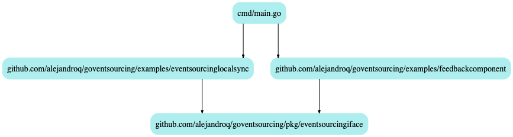

# goventsourcing
*By Alejandro Quesada*

An partial implementation of EventSourcing in Go (prior to the literal store and infrastructure) as I've understood it following the O'Reilly Software Architecture Conference in New York 2020.

## Install

`go get github.com/alejandroq/goventsourcing`

## TODOs
- Setup functional evented services locally (ie. async, lazy, contextualized)
- Setup functional evented services working in Lambda via DynamoDB streams (ie. serverless async)
- Setup functional evented services working in Postgres via Messages-DB (ie. serverful async, more traditional for the work load)

